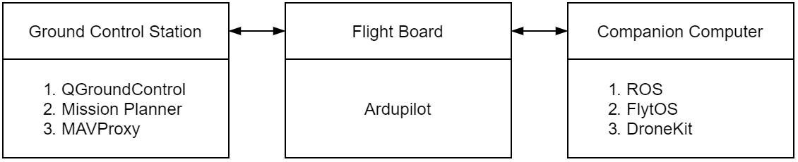
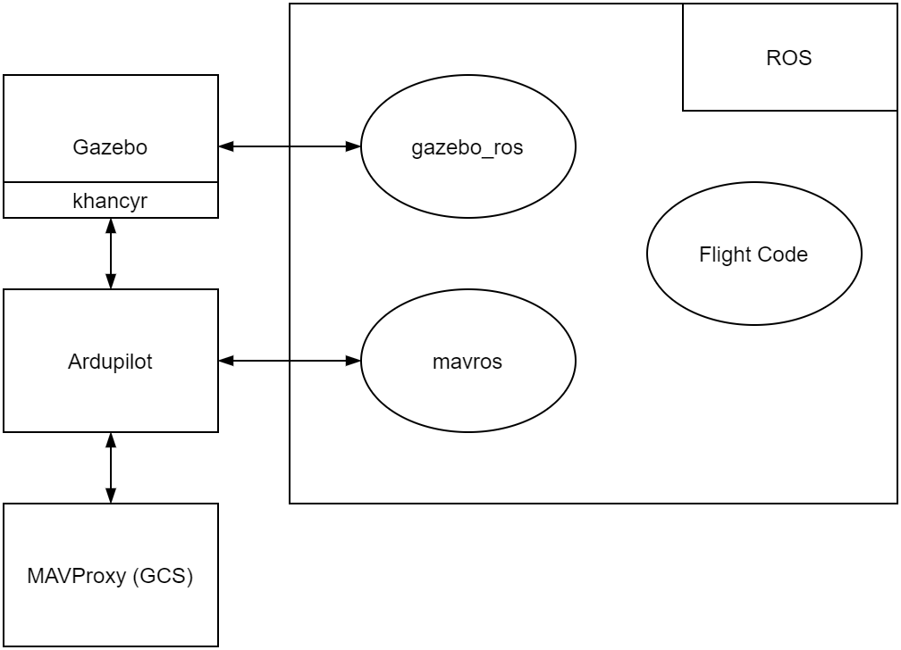

# Gazebo-Arducopter-ROS Guide

## Software Covered
- ROS Melodic
- MAVROS (ROS package)
- Ardupilot
- Ardupilot Gazebo Plugin (khancyr)
- Gazebo 9
- MAVProxy

## Requirements
Tested on Native Ubuntu 18.04.4 and ROS Melodic.

## Quick Installation
Run this command at your preferred directory.  
Script will use current directory to git clone Ardupilot & Ardupilot Gazebo Plugin repositories.

`wget -qO - https://raw.githubusercontent.com/yanhwee/gazebo-ardupilot-ros/master/install.bash | sudo bash`

`sudo` may be opted out but the script may stop halfway to prompt for permission again as the installation takes some time.

As Ardupilot setup script (a part of the script) requires to be ran non-rooted yet still requiring sudo permission, script will stop halfway to prompt for permission again.

Please restart after the installation is done.

The guide below walks through the steps found in the script.

## References
1. ROS Melodic Ubuntu Installation  
http://wiki.ros.org/melodic/Installation/Ubuntu

2. Arducopter  
https://ardupilot.org/dev/docs/building-setup-linux.html

3. khancyr Arducopter Gazebo Plugin  
https://github.com/khancyr/ardupilot_gazebo

4. ROS package: MAVROS  
https://github.com/mavlink/mavros/tree/master/mavros

## Installation Guide

### 0. Prerequisites
1. Git
    - `sudo apt install git`

### 1. ROS (and Gazebo)
1. Follow all steps:  
http://wiki.ros.org/melodic/Installation/Ubuntu
    - Install: `ros-<distro>-desktop-full`
    - For our case: `ros-melodic-desktop-full`
    - Gazebo will be installed alongside ROS

### 2. Ardupilot
1. Git clone:  
https://ardupilot.org/dev/docs/building-setup-linux.html#cloning-with-the-command-line

2. Install required packages:  
https://ardupilot.org/dev/docs/building-setup-linux.html#install-some-required-packages

### 3. Ardupilot Gazebo Plugin (khancyr)
1. Git clone:  
https://github.com/khancyr/ardupilot_gazebo#usage-
    - Skip directly to  
    `git clone https://github.com/khancyr/ardupilot_gazebo`

2. Build:  
https://github.com/khancyr/ardupilot_gazebo#usage-
    - Continue after the git clone
    - Set the paths as well

### 4. MAVROS
1. Binary Installation  
https://github.com/mavlink/mavros/tree/master/mavros#binary-installation-deb
    - Replace 'kinetic' with 'melodic'

2. Install GeographicLib  
https://github.com/mavlink/mavros/tree/master/mavros#binary-installation-deb

### 5. Recommended
1. catkin_tools  
https://ardupilot.org/dev/docs/ros-install.html#installing-mavros
    - `sudo apt-get install python-catkin-tools`

### 6. Optional
1. RQT (ROS package)  
https://ardupilot.org/dev/docs/ros-install.html#installing-mavros
    - Replace 'kinetic' with 'melodic'
    - `sudo apt-get install ros-melodic-rqt ros-melodic-rqt-common-plugins ros-melodic-rqt-robot-plugins`

## Quick Test
1. Without ROS  
    1. https://ardupilot.org/dev/docs/using-gazebo-simulator-with-sitl.html#start-the-simulator
    2. https://ardupilot.org/dev/docs/copter-sitl-mavproxy-tutorial.html

2. With ROS  
    - Check out Intelligent Quad Videos
    - Or look at Learning Resources (Connecting to ROS) & continue with Quick Test (Without ROS step 2)

## Software Architecture Overview
Disclaimer: Despite my best attempt to produce these diagrams, it might not be a 100% accurate.

### In Reality (Physically)

### Software-in-the-Loop (SITL)

## Learning Resources
1. Intelligent Quad  
    1. YouTube  
    https://www.youtube.com/playlist?list=PLy9nLDKxDN683GqAiJ4IVLquYBod_2oA6
    2. GitHub  
    https://github.com/Intelligent-Quads/iq_tutorials

2. ROS
    1. Tutorials  
    http://wiki.ros.org/ROS/Tutorials
    2. Understanding package.xml  
    http://wiki.ros.org/roslaunch/XML
    3. IDEs  
    http://wiki.ros.org/IDEs

3. Catkin
    1. Workspaces  
    http://wiki.ros.org/catkin/workspaces

4. CMake
    1. Understanding CMakeLists.txt  
    https://www.youtube.com/playlist?list=PLK6MXr8gasrGmIiSuVQXpfFuE1uPT615s
    2. Documentation  
    https://cmake.org/cmake/help/v3.17/manual/cmake.1.html

5. Ardupilot
    1. Connecting to ROS  
    https://ardupilot.org/dev/docs/ros-sitl.html
    2. SITL Architecture  
    https://ardupilot.org/dev/docs/sitl-simulator-software-in-the-loop.html#sitl-architecture
    3. Using SITL (sim_vehicle.py & MAVProxy)  
    https://ardupilot.org/dev/docs/using-sitl-for-ardupilot-testing.html
    4. SITL Examples  
    https://ardupilot.org/dev/docs/sitl-examples.html
    5. MAVLink  
    https://ardupilot.org/dev/docs/mavlink-commands.html

6. Arducopter
    1. Paramters List  
    https://ardupilot.org/copter/docs/parameters.html
    2. Flight Modes  
    https://ardupilot.org/copter/docs/flight-modes.html

## Troubleshooting
### 1. Gazebo
1. Slow Gazebo startup or  
libcurl: (6) Could not resolve host: api.ignitionfuel.org
    - https://bitbucket.org/osrf/gazebo/issues/2607/error-restcc-205-during-startup-gazebo
    - In ~/.ignition/fuel/config.yaml, change to:  
        - url: https://fuel.ignitionrobotics.org/1.0/models

2. Bad lighting
    - https://answers.gazebosim.org//question/848/lighting-and-shadow-effect-problems/
    - In world file, set shadow to 0
    - Or in Gazebo >> World >> Scene >> Disable Shadow

### 2. Visual Studio Code
1. Linting for cpp files
    1. Find ROS cpp path
        1. Can be found by  
        `cd / & sudo find -name 'ros.h'`
    2. Add path to "c_cpp_properties.json' include path

