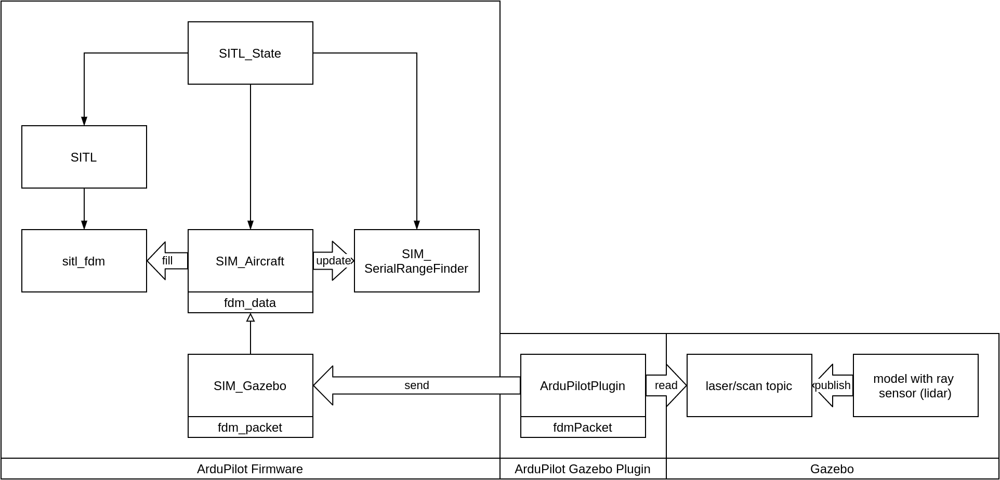
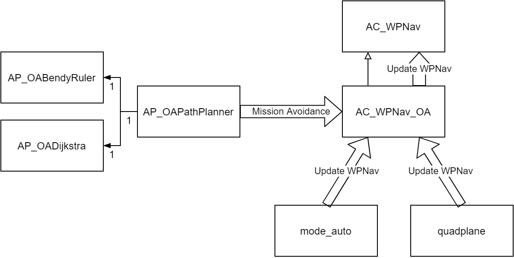

# ArduPilot-Gazebo-ROS Guide

## Software Covered
- Ardupilot
- Ardupilot Gazebo Plugin (khancyr)
- Gazebo 9
- ROS Melodic
- MAVROS (ROS package)
- MAVProxy

## Requirements
Tested on Native Ubuntu 18.04.4 and ROS Melodic.

## Quick Installation
Run this command at your preferred directory.  
Script will use current directory to git clone Ardupilot & Ardupilot Gazebo Plugin repositories.

Default Installation:  
`wget -O - https://raw.githubusercontent.com/yanhwee/gazebo-ardupilot-ros/master/install.bash | bash`

Custom Installation (Alternative installation if you want to use my work):   
`wget -O - https://raw.githubusercontent.com/yanhwee/gazebo-ardupilot-ros/master/install-custom.bash | bash`

Script will refresh the sudo timeout every 10 mins so intallation will not be interrupted.  
Please do not `sudo bash`. This will run as root and script will not work.

Please restart after the installation is done.

The guide below walks through the steps found in the script.

## References
1. ROS Melodic Ubuntu Installation  
http://wiki.ros.org/melodic/Installation/Ubuntu

2. Ardupilot  
https://ardupilot.org/dev/docs/building-setup-linux.html

3. khancyr Ardupilot Gazebo Plugin  
https://github.com/khancyr/ardupilot_gazebo

4. ROS package: MAVROS  
https://github.com/mavlink/mavros/tree/master/mavros

## Installation Guide

### 0. Prerequisites
1. Git
    - `sudo apt install git`

### 1. ROS (and Gazebo)
1. Follow all steps:  
http://wiki.ros.org/melodic/Installation/Ubuntu
    - Install: `ros-<distro>-desktop-full`
    - For our case: `ros-melodic-desktop-full`
    - Gazebo will be installed alongside ROS

### 2. Ardupilot
1. Git clone:  
https://ardupilot.org/dev/docs/building-setup-linux.html#cloning-with-the-command-line

2. Install required packages:  
https://ardupilot.org/dev/docs/building-setup-linux.html#install-some-required-packages

### 3. Ardupilot Gazebo Plugin (khancyr)
1. Git clone:  
https://github.com/khancyr/ardupilot_gazebo#usage-
    - Skip directly to  
    `git clone https://github.com/khancyr/ardupilot_gazebo`

2. Build:  
https://github.com/khancyr/ardupilot_gazebo#usage-
    - Continue after the git clone
    - Set the paths as well

### 4. MAVROS
1. Binary Installation  
https://github.com/mavlink/mavros/tree/master/mavros#binary-installation-deb
    - Replace 'kinetic' with 'melodic'
    - `sudo apt-get install ros-melodic-mavros ros-melodic-mavros-extras`

2. Install GeographicLib  
https://github.com/mavlink/mavros/tree/master/mavros#binary-installation-deb

### 5. Recommended
1. catkin_tools  
https://ardupilot.org/dev/docs/ros-install.html#installing-mavros
    - `sudo apt-get install python-catkin-tools`

### 6. Optional
1. RQT (ROS package)  
https://ardupilot.org/dev/docs/ros-install.html#installing-mavros
    - Replace 'kinetic' with 'melodic'
    - `sudo apt-get install ros-melodic-rqt ros-melodic-rqt-common-plugins ros-melodic-rqt-robot-plugins`

### Custom Installation
This is for the alternative installation script. Other than cloning fork repositories of ArduPilot and ArduPilot Gazebo Plugin rather than the default ones, it adds the following:

1. QGroundControl Daily Builds
    - https://docs.qgroundcontrol.com/en/releases/daily_builds.html
2. Catkin Workspace (Custom)
    - https://github.com/yanhwee/catkin_ws
3. Python MAVLink Library
    - `pip install pymavlink`

## Quick Test
1. Without ROS  
    1. https://ardupilot.org/dev/docs/using-gazebo-simulator-with-sitl.html#start-the-simulator
    2. https://ardupilot.org/dev/docs/copter-sitl-mavproxy-tutorial.html

2. With ROS  
    - Check out Intelligent Quad Videos
    - Or look at Learning Resources (Connecting to ROS) & continue with Quick Test (Without ROS step 2)

3. For Custom Installation (With ROS)
    1. Open four terminals (Tip: Ctrl-Shift-T)
    2. In each:
        1. roslaunch Gazebo world  
        `roslaunch helium hills_lidar.world`
        2. Start ArduPilot SITL  
        `sim_vehicle.py -v ArduCopter -f gazebo-iris --console`
        3. Start QGroundControl (wait a few seconds before doing this step)  
        `./QGroundControl.AppImage`
        4. Start MAVROS (wait a few seconds before doing this step as well)
        `roslaunch helium apm.launch`
    3. Note (for first time):
        1. `sim_vehicle.py` will need time to compile so wait till its done before continuing

## Software Architecture Overview
These psuedo-diagrams are for you to get an idea of how the whole thing works.

### In Reality (Physically)


### Software-in-the-Loop (SITL)


## Learning Resources
1. Intelligent Quad  
    1. YouTube  
    https://www.youtube.com/playlist?list=PLy9nLDKxDN683GqAiJ4IVLquYBod_2oA6
    2. GitHub  
    https://github.com/Intelligent-Quads/iq_tutorials

2. ROS
    1. Tutorials  
    http://wiki.ros.org/ROS/Tutorials
    2. Understanding package.xml  
    http://wiki.ros.org/roslaunch/XML
    3. IDEs  
    http://wiki.ros.org/IDEs

3. Catkin
    1. Workspaces  
    http://wiki.ros.org/catkin/workspaces
    2. catkin_tools  
    https://catkin-tools.readthedocs.io/en/latest/quick_start.html

4. CMake
    1. Understanding CMakeLists.txt  
    https://www.youtube.com/playlist?list=PLK6MXr8gasrGmIiSuVQXpfFuE1uPT615s
    2. Documentation  
    https://cmake.org/cmake/help/v3.17/manual/cmake.1.html

5. Ardupilot
    1. Connecting to ROS  
    https://ardupilot.org/dev/docs/ros-sitl.html
    2. SITL Architecture  
    https://ardupilot.org/dev/docs/sitl-simulator-software-in-the-loop.html#sitl-architecture
    3. Using SITL (sim_vehicle.py & MAVProxy)  
    https://ardupilot.org/dev/docs/using-sitl-for-ardupilot-testing.html
    4. SITL Examples  
    https://ardupilot.org/dev/docs/sitl-examples.html

6. Arducopter
    1. Paramters List  
    https://ardupilot.org/copter/docs/parameters.html
    2. Flight Modes  
    https://ardupilot.org/copter/docs/flight-modes.html

7. MAVLink
    1. MAVLink Messages  
    https://mavlink.io/en/messages/common.html
    2. Copter Commands (Guided)  
    https://ardupilot.org/dev/docs/copter-commands-in-guided-mode.html#copter-commands-in-guided-mode
    3. Copter Commands (Auto / Mission)  
    https://ardupilot.org/copter/docs/common-mavlink-mission-command-messages-mav_cmd.html
    4. Pymavlink (Also applicable to ArduCopter)  
    https://www.ardusub.com/developers/pymavlink.html

8. Gazebo
    1. Tutorials  
    http://gazebosim.org/tutorials
    2. Digitial Elevation Map (DEM)
        1. Tool for getting real-life DEM  
            https://terrain.party/
        2. Heightmap Tutorial  
        https://vimeo.com/58409707
    3. SDFormat Specification  
    http://sdformat.org/spec


## Troubleshooting
### 1. Ardupilot
1. sim_vehicle.py not found
    - Restart Ubuntu

### 2. Gazebo
1. Slow Gazebo startup or  
libcurl: (6) Could not resolve host: api.ignitionfuel.org
    - https://bitbucket.org/osrf/gazebo/issues/2607/error-restcc-205-during-startup-gazebo
    - In ~/.ignition/fuel/config.yaml, change to:  
        - url: https://fuel.ignitionrobotics.org/1.0/models

2. Bad lighting
    - https://answers.gazebosim.org//question/848/lighting-and-shadow-effect-problems/
    - In world file, set shadow to 0
    - Or in Gazebo >> World >> Scene >> Disable Shadow

### 3. Visual Studio Code
1. Linting for cpp files
    1. Find ROS cpp path
        1. Can be found by  
        `cd / && sudo find -name 'ros.h'`
    2. Add path to "c_cpp_properties.json' include path

### 4. Mavproxy
1. Any Problems
    - Try `pip install -U mavproxy`

2. Re-requesting WPs
    - https://github.com/ArduPilot/MAVProxy/issues/402
    - In the MAVProxy Terminal
        - Type: `wp list`

## Tips
### 1. QGroundControl
1. Rebooting ArduPilot
    1. Click on the Gear Icon (Vehicle Setup), top-left of the screen.
    2. Click on the Parameter Tab, bottom left of the Vehicle Setup screen.
    3. Click Tools, top-right of the screen.
        - If not found, click on the Clear Button beside the Search Bar first.
    4. Click "Reboot Vehicle"

## Features Implemented for ArduPilot (ArduCopter) SITL (Custom Installation)
For ArduCopter Version: 4.04 dev

### 1. Terrain Following
1. References
    1. https://discuss.ardupilot.org/t/gazebo-with-lidar/24717/6

2. Psuedo-Diagram  
    

3. Walk-through  
    1. SIM_Gazebo
        1. Modify the FDM Packet to receive the rangefinder value. 
        2. Then, moidfy the function that updates the range value (in SIM_Gazebo) using the received rangefinder value.
    
    2. ArduPilotPlugin.hh/.cc
        1. Modify the FDM Packet to take in the rangefinder value. 
        2. Use Gazebo transport node to read laser topic messages published by laser ray model.

    3. Gazebo  
        1. Create a model file for Lidar.
        2. Use ray sensors with one laser. 
        3. Add this lidar model to iris_with_ardupilot, using links and joints.
            - Laser topic messages is automatically published.

4. ArduPilot Parameters
    1. References
        1. https://ardupilot.org/copter/docs/terrain-following.html
    2. By QGroundControl or MAVProxy
        1. TERRAIN_ENABLE = 1 (Default)

5. Test
    1. QGroundControl
        1. Select MAVLink Inspector
        2. Find Distance Sensor
        3. Plot, 60 secs (optional)

    2. MAVProxy (Alternatively, less preferred way)
        1. https://ardupilot.org/dev/docs/using-sitl-for-ardupilot-testing.html#adding-a-virtual-rangefinder
        2. Don't `param set` anything
        3. Just load the graph

### 2. Object Avoidance
1. References
    1. https://github.com/ArduPilot/ardupilot/issues/5608
    2. https://answers.gazebosim.org//question/18881/publish-a-gazebo-message-into-a-ros-topic/

2. Walk-through
    1. Gazebo
        1. Create model file for 360 lidar.
            1. Ensure the lasers are setup in a "circular" manner
                - Actually clockwise or not it doesn't matter
                    - Rather, ArduPilot parameter, `PRX_ORIENT`, controls the orientation of the proximity sensors
                - Just ensure that `min_angle` starts from 0
                - Don't overlap the first and last laser
                ```
                <samples>n</samples>
                <min_angle>0</min_angle>
                <max_angle>-x<max_angle>
                <!-- where x = 2pi / n * (n - 1) -->
                ```
        2. But this time, publish laser messages via MAVROS.
            1. Use a Gazebo Plugin, "libgazebo_ros_laser.so".
            2. Set publish topic target directly to "/mavros/obstacle/send".
                - It is a mavros rostopic that takes in Gazebo laser messages.
        3. Put lidar model on top of the iris_with_ardupilot using links and joints.

    2. Catkin Workspace
        1. Use roslaunch to run Gazebo. Create a launch file for that.
            - This is for "libgazebo_ros_laser.so", to be able to publish laser messages to rostopic.
    
    3. Run SITL with ROS (as covered in section "Quick Test" above)
        1. `roslaunch Gazebo world`
        2. `sim_vehicle.py -v ArduCopter -f gazebo-iris`
        3. Ensure step 1 & 2 are done setting up...
        4. `roslaunch helium apm.launch`

3. ArduPilot Parameters
    1. References
        1. https://ardupilot.org/copter/docs/common-simple-object-avoidance.html
        2. https://ardupilot.org/copter/docs/common-oa-bendyruler.html
    2. By QGroundControl or MAVProxy
        1. AVOID_ENABLE = 7 (or any values that includes "Proximity Sensors")
        2. PRX_TYPE = 2 (MAVLink)
        3. PRX_ORIENT = 1 (Upside Down)
        4. OA_TYPE = 1 (BendyRuler)

4. Test
    1. Via Terminal
        1. `rostopic echo /mavros/obstacle/send`
    2. QGroundControl
        1. Ensure ArduPilot Parameter, `OA_DB_OUTPUT` >= 2 (Send HIGH and NORMAL importance item)
        2. Obstacle icons should show up on main GUI

### 3. Terrain Following with Object Avoidance
The current version of ArduCopter does not allow terrain following if object avoidance is enabled.

1. Psuedo-Diagram


2. Walk-through
    1. Regardless whether OA is enabled, `AC_WPNav_OA` will always be used rather than `AC_WPNav`. `AC_WPNav_OA::update_wpnav()` will always call `AC_WPNav::update_wpnav()` at the end. The main problem lies within `AC_WPNav_OA`.
    2. `AP_OAPathPlanner` uses threading to process and adjust the waypoints. Sometimes, it isn't ready and will return `AP_OAPathPlanner::OA_Processing`.
    3. A switch case in `AC_WPNav_OA` handles the results. However, if the `OAPathPlanner` is still processing, a false boolean will disable terrain following (for that waypoint). (This might be a bug?)
    4. Since the check occurs so frequently, terrain following will be disabled for all waypoints throughout the mission.
    5. The fix is to replace the false boolean to `_terrain_alt`, a boolean that stores the state of terrain following, true if enabled and false otherwise.